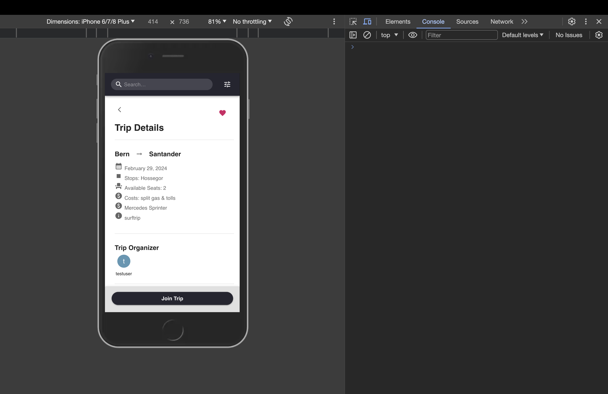

# Surf Taxi: A Full Stack Single Page Application for Surfing Enthusiasts

## Overview

Surf Taxi is the go-to application for surfers across Europe who are looking for a shared lift/carpool to a surfspot.

Built on the understanding that the perfect wave is always shifting and that surfers often traverse the coast in campervans or cars to chase those waves.

Furthermore, many surfers are landlocked and are looking for a ride to the coastline.

This basically means that the modern surfer drives a lot from A to B and back and forth. So there are many potential ride opportunities.

## Important Note:

**Surf Taxi is optimized for mobile use**, offering an excellent experience on smartphones. Although it also works on desktop browsers, you'll get the full visual and functional benefits on a mobile device. If you're on a desktop, you can switch your browser view to a mobile setting (for example, use Chrome's DevTools to simulate an iPhone 7) to see how it looks on a phone.

<!--  -->

## Technology Stack

#### Frontend:

- **React**: Powers the interactive and user-friendly interface.
- **Material UI**: Provides ready-to-use design components for a stylish look.

#### Backend:

- **Node.js**: Runs the server, handling requests and responses.
- **Express.js**: Makes it easier to build and manage the server API.

#### Database:

- **PostgreSQL**: Stores all the app's data safely and efficiently.

#### Testing:

- **Jest and Supertest**: Test the backend to make sure everything works as expected.
- **Vite-test**: Helps ensure the frontend runs smoothly and correctly.

## Project Structure

- `backend/`: Contains the API and data management logic.
- `frontend/`: Houses the React application for user interfaces.

## Setup Instructions

### Backend

#### Database Setup:

1. Create the Surf Taxi database: `createdb surf_taxi`
2. Initialize the database: `psql -U [psql username] -d surf_taxi -f dbSetup.sql`

For more detailed information on the database schema, including tables, relationships, and indices, please refer to the documentation provided in the `docs/` directory under [databaseSchema](backend/docs/databaseSchema).

#### Starting the Backend:

1. Navigate to the backend directory: `cd backend`
2. Install dependencies: `npm install`
3. Start the server: `npm start` (Runs on port 3001)

### Frontend

#### Environment Setup:

- Ensure the backend URL is set correctly in the frontend code to connect to `http://localhost:3001`.

#### Running the Frontend:

1. Navigate to the frontend directory: `cd frontend`
2. Install dependencies: `npm install`
3. Start the app: `npm start` (Access at `http://localhost:3000`)

### Testing the Backend

1. Create the Surf Taxi Test database: `createdb surf_taxi_test`
2. Initialize the database: `psql -U [psql username] -d surf_taxi_test -f db/dbSetupTests.sql`
3. Ensure Jest and Supertest are installed: `npm install --save-dev jest supertest`
4. Run tests: `npm test`

### Testing the Frontend

...

## Using the API

The backend API supports various endpoints for trips, passengers, notifications, authentication and user profiles. Detailed API documentation and examples can be found in the provided Postman collection.

### Routes

- `/`: Homepage
- `/trips`: Lists all trips
- `/trips/:tripId`: View details of a specific trip
- `/login`: Login form
- `/signup`: Signup form
- `/profile`: Profile page

## Deployment

The application is optimized for mobile use and is best experienced on mobile devices or through device emulation tools like Chrome DevTools set to iPhone 7.

The application is deployed on Render:

- **Backend**: [https://surf-taxi-api.onrender.com](https://surf-taxi-api.onrender.com)
- **Frontend**: [https://surf-taxi.onrender.com](https://surf-taxi.onrender.com)

## Author

**Marc Schaer**

Feel free to reach out for any questions or feedback:

- Email: marc.schaer93@gmail.com
- LinkedIn: [https://www.linkedin.com/in/marc-sch%C3%A4r-216283262/](https://www.linkedin.com/in/marc-sch%C3%A4r-216283262/)
